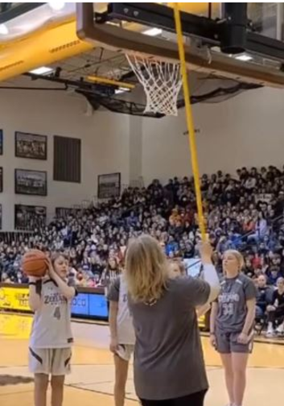
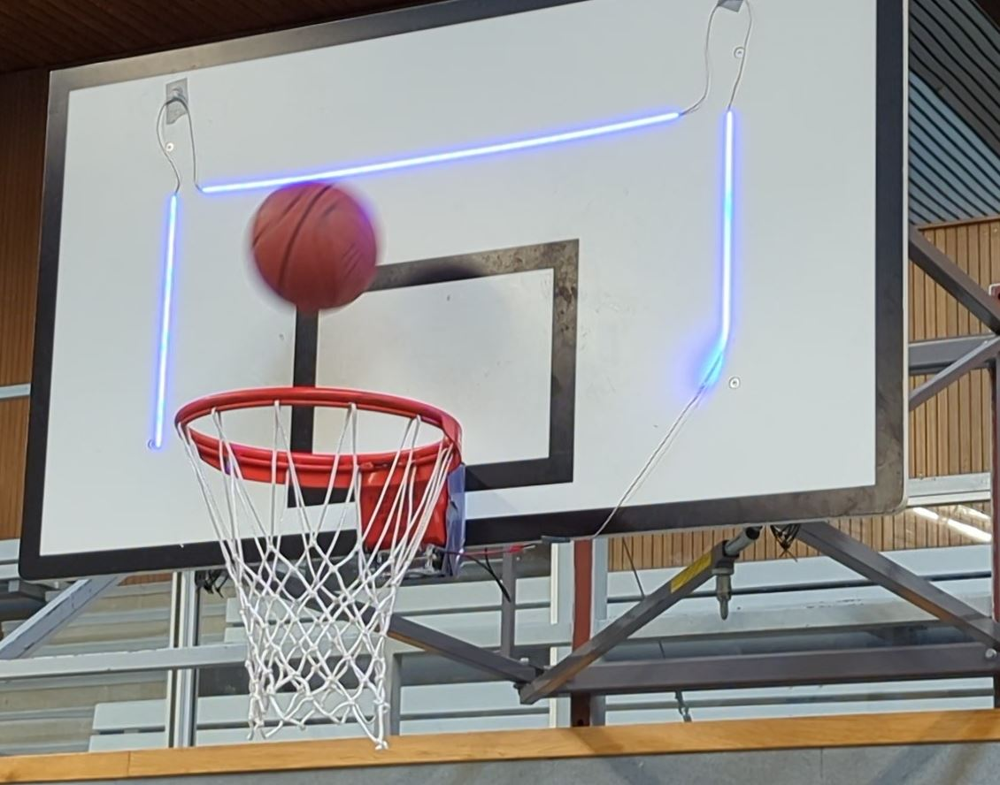
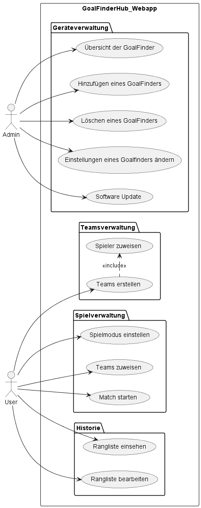
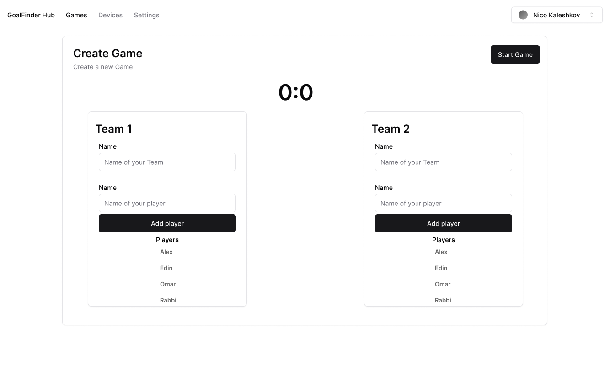
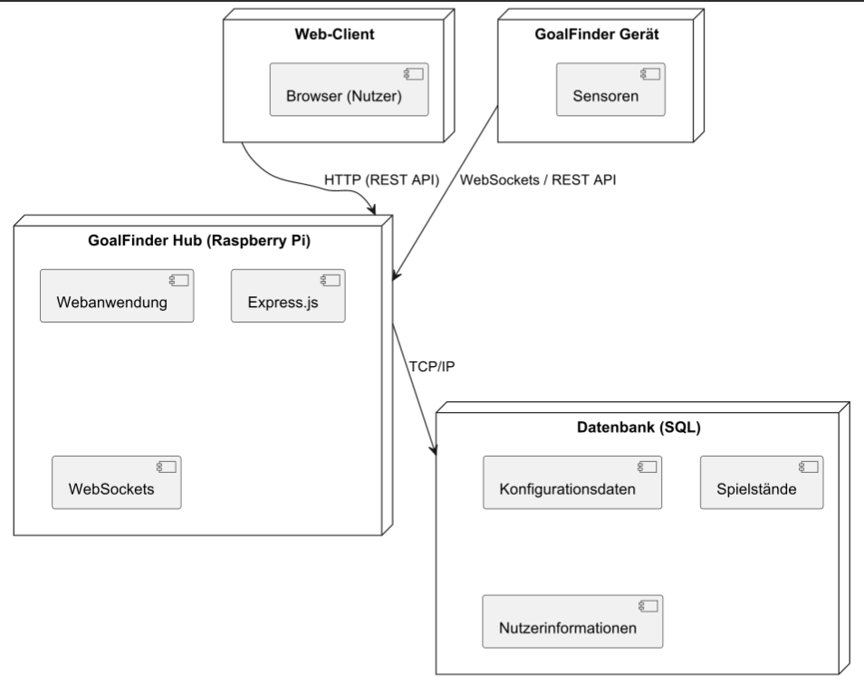
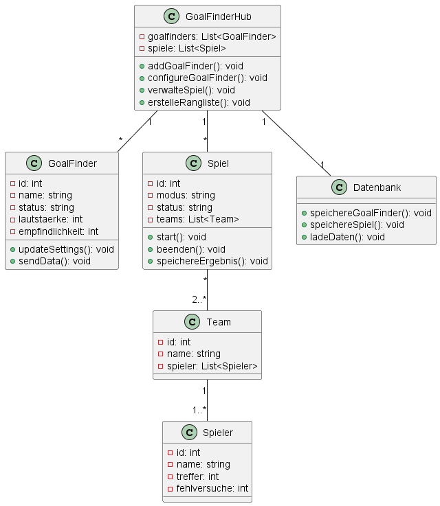

# Pflichtenheft `GoalFinder Hub`

## Inhaltsverzeichnis

- [Pflichtenheft `GoalFinder Hub`](#pflichtenheft-goalfinder-hub)
  - [Inhaltsverzeichnis](#inhaltsverzeichnis)
  - [1. Ausgangslage](#1-ausgangslage)
    - [1.1. Ist-Situation](#11-ist-situation)
    - [1.2. Verbesserungspotenziale](#12-verbesserungspotenziale)
  - [2. Zielsetzung](#2-zielsetzung)
  - [3. Funktionale Anforderungen](#3-funktionale-anforderungen)
    - [3.1. Use Case Überblick](#31-use-case-überblick)
    - [3.2. Use Case A: Übersicht der Goalfinder](#32-use-case-a-übersicht-der-goalfinder)
      - [3.2.1 GUI-Design](#321-gui-design)
      - [3.2.2 Workflow](#322-workflow)
    - [3.3 Use Case B: Hinzufügen eines Goalfinders](#33-use-case-b-hinzufügen-eines-goalfinders)
      - [3.3.2 Workflow](#332-workflow)
    - [3.4 Use Case C: Verwalten eines Goalfinders](#34-use-case-c-verwalten-eines-goalfinders)
      - [3.4.1 GUI Design](#341-gui-design)
      - [3.4.2 Workflow](#342-workflow)
    - [3.5 Use Case D: Match verwalten](#35-use-case-d-match-verwalten)
      - [3.5.1 GUI Design](#351-gui-design)
      - [3.5.2 Workflow](#352-workflow)
  - [4. Nicht-funktionale Anforderungen](#4-nicht-funktionale-anforderungen)
    - [`Usability`: Benutzbarkeitsanforderung](#usability-benutzbarkeitsanforderung)
    - [`Efficiency`: Effizienzanforderung](#efficiency-effizienzanforderung)
    - [`Maintenance`: Wartbarkeits- und Portierbarkeitsanforderung](#maintenance-wartbarkeits--und-portierbarkeitsanforderung)
    - [`Security`: Sicherheitsanforderung](#security-sicherheitsanforderung)
    - [`Legal`: Gesetzliche Anforderung](#legal-gesetzliche-anforderung)
  - [5. Mengengerüst](#5-mengengerüst)
  - [6. Systemarchitektur](#6-systemarchitektur)
    - [6.1 Deployment-Diagramm](#61-deployment-diagramm)
  - [GoalFinder Hub (Raspberry Pi):](#goalfinder-hub-raspberry-pi)
  - [GoalFinder Geräte:](#goalfinder-geräte)
  - [Datenbank:](#datenbank)
  - [Web-Client:](#web-client)
    - [6.2 Datenmodell](#62-datenmodell)

## 1. Ausgangslage

### 1.1. Ist-Situation

Ballsportarten wie Fußball und Basketball haben sich in den letzten Jahrzehnten zu den beliebtesten Sportarten der Welt entwickelt.
Jedoch können Personen mit Beeinträchtigungen nur schwer und nur mit vielen Einschränkungen an diesen Ballsportarten teilnehmen.

Da eine Basketballpartie mit zwei gegnerischen Teams mit sehbehinderten Personen derzeit nur schwer realisierbar ist, 
spielen betroffene Personen eine Vereinfachung von Basketball - ein Wurfspiel, 
wo die SpielerInnen nacheinander den Ball werfen und versuchen einen Korb zu erzielen. Bei einem erfolgreichen Treffer erhalten sie Punkte.

Dabei benötigen die sehbehinderten SpielerInnen eine akustische Unterstützung zur Ortung des Korbes und eine Rückmeldung, wenn der Korb getroffen wird. Diese Aufgaben erfüllt meistens eine Person.

Um den sehbehinderten Spielern mehr Freiheit z.B. neue Spielmodi zusätzlich zum Wurfspiel, eine verbesserte Ortung (akustisch und visuell) und bessere Rückmeldung zu ermöglichen, wurde ein Gerät entwickelt, das alle zuvor genannten Funktionen erfüllen soll - der **GoalFinder**.

GoalFinder umfasst derzeit folgendes Feature-Set:
- Ein LED-Streifen zur visuellen Ortung & ständige akustische Hinweise (Metronomsound) zur akustischen Ortung des Korbs 
- Erkennung eines Treffers bzw. Fehlschusses mithilfe von ToF- und Vibrationssensor
- Ausgabe eines "Win" bzw. "Lose" Sounds bei Treffer bzw. Fehlschuss
- Konfiguration des GoalFinders, wie Lautstärke, Empfindlichkeit der Sensoren, allgemeine Systemeinstellungen, usw. durch Webapp
- Erstellen und Spielen von Spielmodi (derzeit nur Wurfspiel (Trefferzähler)) mit Webapp
- Rangliste bei abgeschlossenem Spiel.
- Aktualisierung der Gerätesoftware „Over-the-Air“ (drahtlos)

### 1.2. Verbesserungspotenziale

Derzeit sind die GoalFinder nur einzeln konfigurierbar, was in einer Sporthalle, mit mehreren Körben, an denen ein GoalFinder montiert ist, ziemlich unübersichtlich werden kann. Wenn man z.B. die Lautstärke auf jedem GoalFinder ändern will, müsste man sich mit jedem einzeln verbinden, um dies zu tun. 

Zusätzlich werden keine Spieldaten gespeichert und man muss somit die Spieldaten händisch notieren.

Deswegen soll eine Zentrale geschaffen werden, die die Verwaltung aller GoalFinder ermöglicht und die einzelnen Spieldaten der GoalFinder speichern und weiterverarbeiten kann.

## 2. Zielsetzung

Der GoalFinder Hub soll es ermöglichen, mehrere GoalFinder zu verwalten und die Spieldaten an einem zentralen Ort zu speichern und diese weiter in Statistiken und Ranglisten zu verarbeiten. Zudem sollen die aktuell laufenden Spiele alle an einem zentralen Ort überwacht werden können (z.B. für Wettbewerbe).

## 3. Funktionale Anforderungen

Der GoalFinder Hub basiert auf einem Raspberry Pi und bietet die Funktionalität auf einer Webapp an.

- Konfiguration und Fernwartung von mehreren GoalFindern mit Persistenz in einer Datenbank
- Kommunikation mit GoalFinders
  - damit deren Korbtreffer und Korbrahmentreffer-Meldungen empfangen und ausgewertet werden
  - Ansteuern von GoalFindern (z.B. Lautstärke, Empfindlichkeit des Vibrationssensors, usw.)
  - Kommunikation der einzelnen GoalFinder über REST API
- Spiele-Verwaltung
  - Dashboard über Spiele
  - Spieler und Spieler-Teams hinzufügen/bearbeiten/löschen
  - Spiele anlegen/bearbeiten/löschen und Spieler dafür managen
  - Spiel starten und durchführen: Hub legt fest, welcher Spieler an der Reihe ist. Erkennung Treffer oder Fehlschuss etc.
  - Spiele Statistik, Ranglisten, Bonussystem
  - Regeln für Spiele konfigurieren
  - Daten der Spiele, wie Endergebnis und Teams in einer Datenbank speichern

### 3.1. Use Case Überblick

 Auf diesem Diagramm sieht man den groben Featureset und, was der User auf der Webapp des GoalfinderHubs bedienen oder sehen kann. 

### 3.2. Use Case A: Übersicht der Goalfinder

#### 3.2.1 GUI-Design

#### 3.2.2 Workflow
Hierfür wird man eine Sammlung an Goalfinders brauchen. Jeder Goalfinder muss aufgelistet werden, mit dem entsprechenden Status. Dazu wird man die Sammlung durchgehen müssen und auch schauen müssen, ob der Goalfinder ein- oder ausgeschaltet ist.
### 3.3 Use Case B: Hinzufügen eines Goalfinders

#### 3.3.2 Workflow
Hier braucht man erstmal ein Eingabefeld für den Namen und den Status, mit dem der Goalfinder initialisiert werden soll. Außerdem muss man überprüfen, ob der Name nicht leer ist und beim Status nur "online" oder "offline" (Groß- oder Kleinschreibung egal) eingegeben wird. Falls ein Fehler auftritt, muss der User darüber informiert werden, das Feld auszubessern. Danach braucht man einen Button fürs Hinzufügen oder Abbrechen. Falls der User auf Hinzufügen klickt, soll der neue Goalfinder der Sammlung hinzugefügt werden. Falls der User auf Abbrechen klickt, sollen die Daten aus den Eingabefeldern gelöscht werden.

### 3.4 Use Case C: Verwalten eines Goalfinders

#### 3.4.1 GUI Design

#### 3.4.2 Workflow
Wenn der User auf Einstellungen übernehmen klickt, muss erstmal in den Feldern, wo der User selbst etwas eintippt, überprüft werden, ob die Werte zur jeweiligen Einstellung passen und nicht leer sind. Bei den Feldern, wo der User die Einstellung auswählen kann, muss überprüft werden, ob er eh etwas ausgewählt hat.Falls ein Fehler auftritt, muss der User darüber informiert werden, das Feld auszubessern. Falls der User auf die Option "Software-Update durchführen" klickt, könnte man das mit einem SUOTA-Dienst lösen, der die Änderungen in den jeweiligen Dateien, die durch das Software-Update entstanden sind, in einem bin-Ordner sammelt und sie dann auf den ESP flasht. Um dann die Einstellungen zu übernehmen, braucht man einen Web-Server, um mit dem ESP zu kommunizieren.

### 3.5 Use Case D: Match verwalten

#### 3.5.1 GUI Design

#### 3.5.2 Workflow

Erstmal wählt der User den Spielmodus aus. Kann dann 1-beliebig viele Teams erstellen und in diese Teams 1-beliebig viele Spieler hinzufügen. Dabei muss überprüft werden,ob der User einen Modus ausgewählt hat, mindestens ein Team erstellt hat und jedem Team mindestens einen Sieler hinzugefügt hat. Außerdem muss man darauf achten, dass der User die Team- und Spielernamen nicht leer ausfüllt. Falls ein Fehler auftritt, soll der User darüber informiert werden, diesen zu korriegieren. Wenn dann alles passt und der User bereit ist, kann er das Match starten, mithilfe des "Match starten" Buttons. Nachdem soll sich eine Seite öffnen, wo alle laufenden Matches angezeigt werden. Dies könnte man mithilfe von Klassen abbilden. Falls der User dann das jeweilige Match beenden will, kann er auf den "Match beenden" Button klicken. Danach soll sich wieder eine neue Seite öffnen, wo dann die Rangliste des jeweiligen Spiels angezeigt wird. Die Rangliste bildet sich im Körbezähler-Modus aus der Differenz der Treffer und Fehltreffer, im Team vs Team Modus aus Treffern. Falls der User möchte, kann er die Rangliste speichern.

## 4. Nicht-funktionale Anforderungen

### `Usability`: Benutzbarkeitsanforderung
Die Website sollte mit einem Screenreader nutzbar sein.

Die Website sollte eine gute Struktur und Semantik aufweisen.

Die Website sollte einen hohen Farbkontrast haben.

### `Efficiency`: Effizienzanforderung
Der Server sollte auf Anfragen innerhalb von 500 ms antworten.

Datenbankabfragen sollten nicht länger als 200 ms dauern.

Das System sollte in der Lage sein, mehrere Goalfinder parallel zu verwalten.

### `Maintenance`: Wartbarkeits- und Portierbarkeitsanforderung
Das System soll auf dem Raspberry Pi lauffähig sein.

Die Anwendung soll über regelmäßige Software-Updates erweiterbar sein.

Der Code soll so strukturiert sein, dass man ihn problemlos erweitern kann, also zB. dass man eine Datei hinzufügen kann
und die Anwendung trotzdem normal läuft, ohne das man in den bestehenden Dateien etwas am Code ändern muss.

### `Security`: Sicherheitsanforderung
Die Kommunikation zwischen Client und Server muss durch TLS verschlüsselt sein.

Die gespeicherten Spieldaten müssen durch rollenbasierte Zugriffskontrollen geschützt sein.

Das System muss Schutzmechanismen gegen Brute-Force- und SQL-Injection-Angriffe implementieren.

### `Legal`: Gesetzliche Anforderung
Die Anwendung muss die Datenschutz-Grundverordnung (DSGVO) einhalten.

Alle gespeicherten personenbezogenen Daten müssen verschlüsselt gespeichert werden.

## 5. Mengengerüst
Erwartete gleichzeitige Nutzer: 2–10

Durchschnittliche Anzahl der GoalFinder-Geräte pro Nutzer: 1–3

Durchschnittliche gespeicherte Spieldaten pro Match: 1–5 KB

API-Aufrufe pro Minute: ca. 0–20

Datenbankanfragen pro Sekunde: ca. 0–30

## 6. Systemarchitektur

### 6.1 Deployment-Diagramm
Die Systemarchitektur basiert auf einem Client-Server-Modell mit einer zentralen Datenbank. Die Hauptkomponenten sind:

## GoalFinder Hub (Raspberry Pi):

Hostet die Webanwendung

Kommuniziert mit den GoalFinder-Geräten

Verwaltet Spieldaten

## GoalFinder Geräte:

Senden Echtzeitdaten an den Hub

Empfangen Konfigurationsanweisungen

## Datenbank:

Speichert Konfigurationsdaten, Spielstände, Nutzerinformationen

## Web-Client:

Ermöglicht Nutzern die Verwaltung über eine Web-Oberfläche

Kommunikationsschnittstellen:

REST API für externe Anwendungen

WebSockets für Echtzeitkommunikation

### 6.2 Datenmodell

