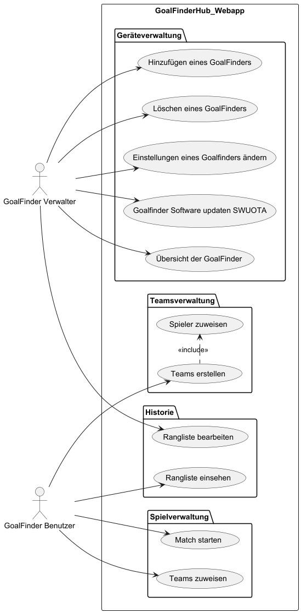

# Pflichtenheft `GoalFinder Hub`

## Inhaltsverzeichnis

- [1. Ausgangslage](#1-ausgangslage)
  - [1.1. Ist-Situation](#11-ist-situation)
  - [1.2. Verbesserungspotenziale](#12-verbesserungspotenziale)
- [2. Zielsetzung](#2-zielsetzung)
- [3. Funktionale Anforderungen](#3-funktionale-anforderungen)
  - [3.1. Use Case Überblick](#31-use-case-%C3%BCberblick)
  - [3.2. Use Case A](#32-use-case-a)
    - [3.2.1 GUI-Design](#321-gui-design)
    - [3.2.2 Workflow](#322-workflow)
  - [3.3 Use Case B](#33-use-case-b)
    - [3.3.1 GUI Design](#331-gui-design)
    - [3.3.2 Workflow](#332-workflow)
  - [3.4 ...](#34)
- [4. Nicht-funktionale Anforderungen](#4-nicht-funktionale-anforderungen)
  - [`Usability`: Benutzbarkeitsanforderung](#usability-benutzbarkeitsanforderung)
  - [`Efficiency`: Effizienzanforderung](#efficiency-effizienzanforderung)
  - [`Maintenance`: Wartbarkeits- und Portierbarkeitsanforderung](#maintenance-wartbarkeits--und-portierbarkeitsanforderung)
  - [`Security`: Sicherheitsanforderung](#security-sicherheitsanforderung)
  - [`Legal`: Gesetzliche Anforderung](#legal-gesetzliche-anforderung)
- [5. Mengengerüst](#5-mengenger%C3%BCst)
- [6. Systemarchitektur](#6-systemarchitektur)
  - [6.1 Deployment-Diagramm](#61-deployment-diagramm)
  - [6.2 Datenmodell](#62-datenmodell)

## 1. Ausgangslage

### 1.1. Ist-Situation

- Siehe Projektantrag

### 1.2. Verbesserungspotenziale

- Siehe Projektantrag

## 2. Zielsetzung

- Siehe Projektantrag

## 3. Funktionale Anforderungen

Dieser Abschnitt hat die Aufgabe, die Funktionalität des zu entwickelnden Systems aus End-User-Sicht sowohl überblicksartig als auch detaillierter zu beschreiben.

### 3.1. Use Case Überblick

- Ein oder mehrere `UML Use Case Diagramme` (=> siehe https://hoelzel.at/flip/160775/280/index.html S. 280 - 282) visualisieren das gesamte geplante Featureset im Groben
- Basis dafür ist die Mindmap aus dem Projektantrag => Ergänzen Sie relevante Rollen (für welche User-Gruppe ist ein Feature wichtig?)
- Mit kurzen verbalen Beschreibungen der Diagramme

### 3.2. Use Case A

Nun folgen Detailbeschreibungen für alle Use Cases aus dem Use Case Diagramm. Für jeden Use Case sind folgende Details notwendig:

#### 3.2.1 GUI-Design

- Zeigen Sie hier den GUI-Mockup, den Sie für diesen Use Case designed haben (mit Figma oder einem anderen GUI-Mockup-Tool Ihrer Wahl)
- Ergänzen Sie das Bild mit verbalen Beschreibungen, wenn nötig.

#### 3.2.2 Workflow

- Erklären Sie hier die internen Abläufe, die für die Umsetzung des Use Cases notwendig sind
- Verwenden Sie dazu - wenn der Ablauf komplex genug ist - ein `UML Activity Diagram`

### 3.3 Use Case B

#### 3.3.1 GUI Design
#### 3.3.2 Workflow

### 3.4 ...

## 4. Nicht-funktionale Anforderungen

Nicht-funktionale Anforderungen beschreiben Anforderungen an das System, die nicht-fachlicher Natur sind, jedoch entscheidend zur Anwendbarkeit des Systems beitragen. Sie definieren beispielsweise Qualitätsanforderungen, Sicherheitsanforderungen oder Performanceanforderungen.

Nicht-funktionale Anforderungen definieren grundlegende Eigenschaften eines Systems, die im Architekturentwurf berücksichtigt werden müssen. Da diese Anforderungen auch die Entwicklungskosten beeinflussen (können), müssen sie messbar beschrieben werden.

- FALSCH: Das System muss schnell sein.
- RICHTIG: Daten müssen spätestens innerhalb von 500 ms zurückgegeben werden.

Zur einfachen Strukturierung der Anforderungen werden diejenigen Anforderungen, die nicht eindeutig zu den funktionalen Anforderungen gehören, den nicht-funktionalen Anforderungen zugeordnet.

Hier ein Überblick über mögliche nicht-funktionale Anforderungen:

### `Usability`: Benutzbarkeitsanforderung

- Wie muss die Software beschaffen sein, damit die Zielgruppe gerne damit arbeitet?
- Beispiel:
  - Die Software soll dem Erscheinungsbild anderer Produkte des Herstellers entsprechen.

### `Efficiency`: Effizienzanforderung

- Hier geht es sowohl um Laufzeit- als auch um Speichereffizienz. Was wird unter dem sparsamen Einsatz dieser Ressourcen verstanden?
- Beispiel:
  - Die Berechnung darf nicht länger als 0,25 Sekunden dauern.

### `Maintenance`: Wartbarkeits- und Portierbarkeitsanforderung

- Welcher Grad an Änderbarkeit wird gefordert? Hier werden, soweit wie möglich, kommende Anpassungen und Erweiterungen vorhergesehen.
- Beispiel:
  - Das Produkt soll später auch in englischer Sprache verfügbar sein.

### `Security`: Sicherheitsanforderung

- Zu den Sicherheitsanforderungen gehören die Aspekte Vertraulichkeit, Datenintegrität und Verfügbarkeit.
  - Wie sehr müssen die Daten vor dem Zugriff durch Dritte geschützt werden?
  - Ist es entscheidend, die Korrektheit der erfassten Daten und ihre Konsistenz zu gewährleisten?
  - Dürfen Systemausfälle vorkommen?
- Beispiel:
  - Das System muss gewährleisten, dass Daten nie verändert werden können.

### `Legal`: Gesetzliche Anforderung

- Welche Standards und Gesetze müssen beachtet werden?
- Beispiel:
  - Das Produkt muss die ISO 9000 Norm erfüllen.

## 5. Mengengerüst

Zur Abschätzung der aufkommenden Datenmengen und damit verbunden der notwendigen Infrastruktur, um die nötige Performance zu erzielen, ist ein Mengengerüst zu erstellen. Mögliche Fragestellungen:

- Wieviele User werden erwartet?
- Wieviele Daten pro User werden erwartet?
- Mit welcher Anfrage-Frequenz wird gerechnet?

## 6. Systemarchitektur

### 6.1 Deployment-Diagramm
- Auflistung der Softwarekomponenten in einem Verteilungsdiagramm (typisch: Client - Server - Datenbank).
- Beispiel:

### 6.2 Datenmodell

- Wahlweise ER-Diagramm oder objekt-orientiertes Klassendiagramm
